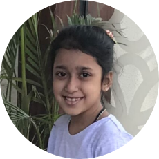

<!DOCTYPE html>
<html lang="en">
<head>
    <meta charset="UTF-8">
    <meta name="viewport" content="width=device-width, initial-scale=1.0">
    <title>Riddhima's Website</title>
    <link rel="stylesheet" href="css/styles.css">
</head>
<body>
    <table cellspacing="20">
        <tr>
            <td></td>
            <td><h1>Riddhima Gurnani</h1>
                
<em>I am a student in <strong><a href="http://www.tsrs.org/reach-us/contact-us/">The Shri Ram school Aravili</a></strong></em>

             
I am an animal lover and have 2 beautiful looking dogs. I love IT & Yoga and want to become an IT Proffesional!
   </td>
        </tr>
    </table>
    
    

<h3><a href="Awards.html">Awards</h3></a>
 

 
<h3><a href="My Hobbies.html">My Hobbies</a></h3>
 

 
<h3><a href="Contact Information.html">My Contact Information</a></h3>
</ul>

<h3>Sugested Websites</h3>
<h3>click on the given text to veiw their websites/webpages</h3>
<ol>
<li><strong><a href="https://pixteller.com/">Pixteller</a></strong>= a website that lets you format or what you call create your own image</li>    
<li><strong><a href="https://codepen.io/">Codepen</a></strong>= a website which can help in HTML CSS and JS</li>
<li><strong><a href="https://devdocs.io/">Devdocs</a></strong>= a website on API</li>
<li><strong><a href="http://www.tsrs.org/">TSRS (The Shri Ram School)</a></strong>=a school website</li>
<li><strong><A href="https://www.fotor.com/">Fotor</a></strong>= a website in which you can make your own posters,resume,youtube chanel art, ect</li>
<li><strong><a href="https://developer.mozilla.org/en-US/">Mozilla</a></strong>= a website that has information about MDN</li>
</ol>

<h3>Grade(class)</h3>
<table cellspacing="30">
    <thead>
        <tr>
            <th>Years</th>
            <th>Grade</th>
</tr>
    </thead>
    <tbody>
        <tr>
            <td>2015-2016</td>
            <td>PV  or  Pravesh Vatika  or Pre KG</td>
        </tr>
        <tr>
            <td>2016-2017</td>
            <td>UPVAN  or  KG</td>
        </tr>
    </tbody>
    </table>

<h3>Skills</h3>

<table>
    <tr>
        <td><table cellspacing="10">
            <tr>
                <td>IT</td>
                <td>❤️️❤️️❤️️❤️️❤️️</td>
            </tr>
            <tr>
                <td>English</td>
                <td>❤️️❤️️❤️️❤️💔️</td>
            </tr>
            <tr>
                <td>Hindi</td>
                <td>❤️️❤️️❤️️❤️️💔</td>
            </tr>
            <tr>
                <td>SST</td>
                <td>❤️️❤️️❤️️💔💔</td>
            </tr>
            <tr>
                <td>Science</td>
                <td>❤️️❤️️❤️️❤️️💔</td>
            </tr>
            <tr>
                <td>Maths</td>
                <td>❤️️❤️️❤️️💔💔</td>
            </tr>
            <tr>
                <td>Art</td>
                <td>❤️️❤️️❤️️❤️️❤️️</td>
            </tr>
            <tr>
                <td>Physical Exersize (PE)</td>
                <td>❤️️❤️💔💔💔</td>
            </tr>
            <tr>
                <td>Clay</td>
                <td>❤️️❤️️❤️️❤️️💔</td>
            </tr>
            <tr>
                <td>Library</td>
                <td>❤️️❤️️💔💔💔</td>
            </tr>
        </tbody>
        </table></td>
    </tr>
</table>

<h4>website maker= Riddhima Gurnani</h4>
</body>
</html>
